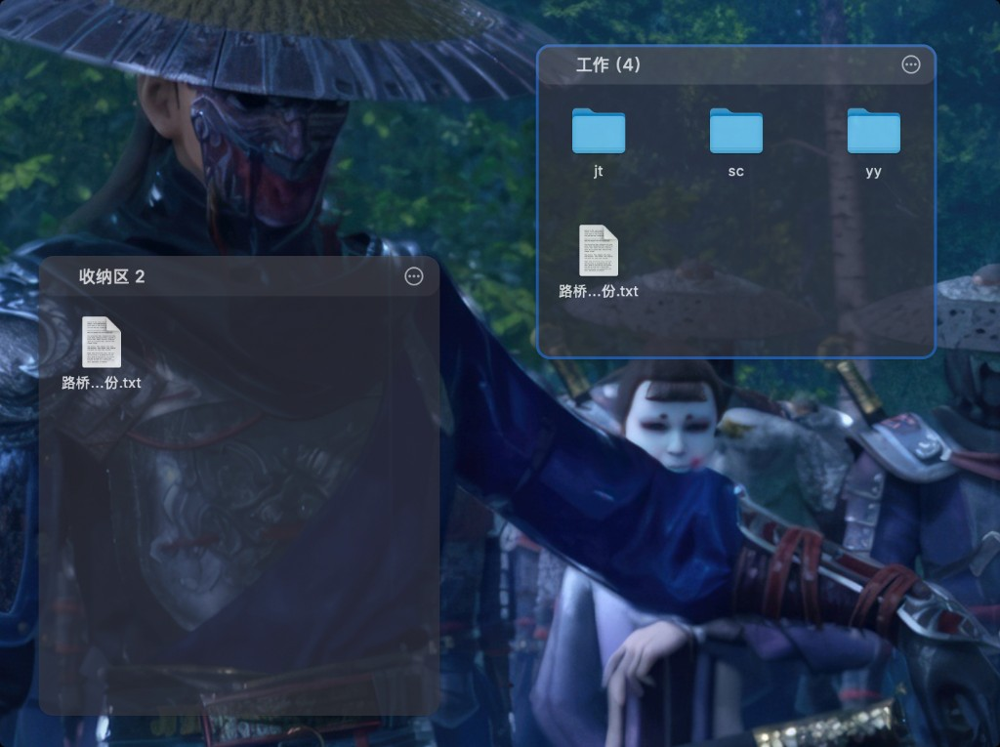
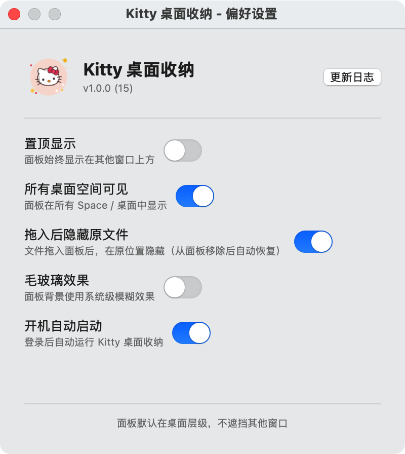

# Kitty 桌面收纳

一款 macOS 桌面文件整理工具，通过浮动面板将桌面文件分区归类，保持桌面整洁。

类似 Windows 上的 [Fences](https://www.stardock.com/products/fences/)，但为 macOS 原生打造。

## 截图

<p align="center">
  
</p>

<p align="center">
  
</p>

## 功能特性

**面板管理**

- 创建多个可拖动、可调整大小的浮动面板
- 自定义面板名称、背景颜色、透明度
- 精确输入面板宽高（像素级控制）
- 毛玻璃背景效果（`NSVisualEffectView`）
- 面板锁定，防止误拖动和误调整大小
- 双击标题栏折叠/展开面板

**文件操作**

- 拖放文件和文件夹到面板中管理
- 从面板拖出文件到 Finder 或其他应用
- Quick Look 预览（选中文件按空格键）
- 文件排序（按名称 / 类型 / 添加日期）
- 右键菜单：打开、在 Finder 中显示、移除、删除
- 拖入面板后可隐藏桌面上的原始文件

**桌面集成**

- 菜单栏常驻，不占用 Dock 位置
- 全局热键 `⌥⌘D` 一键显示/隐藏所有面板
- 贴边收缩：拖到屏幕边缘自动折叠，鼠标悬停展开
- 支持多桌面（Spaces）显示
- 开机自动启动

**数据管理**

- 面板布局导入/导出（JSON 格式备份与恢复）
- 安全书签（Security-Scoped Bookmarks）持久化文件引用
- 自动保存面板配置

## 系统要求

- macOS 13.0 (Ventura) 或更高版本
- Apple Silicon / Intel Mac

## 安装

1. 从 [Releases](../../releases) 下载最新的 `.dmg` 文件
2. 打开 DMG，将「Kitty 桌面收纳」拖入 Applications 文件夹
3. 从 Launchpad 或 Applications 启动应用
4. 菜单栏出现 Kitty 图标即表示运行中

## 使用方法

| 操作       | 方式                   |
| ---------- | ---------------------- |
| 新建面板   | 菜单栏图标 → 新建面板  |
| 添加文件   | 将文件拖入面板         |
| 移动面板   | 拖动面板标题栏         |
| 调整大小   | 拖动面板边缘           |
| 面板设置   | 点击面板标题栏齿轮图标 |
| 显示/隐藏  | `⌥⌘D` 或菜单栏切换     |
| Quick Look | 选中文件后按空格键     |
| 贴边折叠   | 将面板拖到屏幕边缘     |

## 技术栈

- **语言**: Swift 5.9
- **UI 框架**: AppKit（面板、拖放、菜单）+ SwiftUI（设置界面）
- **项目管理**: [XcodeGen](https://github.com/yonaskolb/XcodeGen)（`project.yml` → Xcode 项目）
- **最低部署**: macOS 13.0
- **无第三方依赖**，完全基于 Apple 原生框架

## 项目结构

```
KittyDesktop/
├── project.yml                  # XcodeGen 项目配置（版本号、构建设置）
├── Resources/
│   ├── Info.plist
│   ├── KittyDesktop.entitlements
│   ├── Assets.xcassets           # App 图标
│   └── menubar_icon.png          # 菜单栏图标
└── Sources/
    ├── App/                      # 应用入口与核心管理
    │   ├── main.swift
    │   ├── AppDelegate.swift
    │   ├── PanelManager.swift
    │   └── StatusBarController.swift
    ├── Panel/                    # 面板 UI 组件
    │   ├── FencePanel.swift       # NSPanel 子类
    │   ├── FencePanelView.swift   # 面板内容视图
    │   ├── FileGridView.swift     # 文件网格
    │   ├── FileGridItem.swift     # 网格项
    │   └── PanelTitleBar.swift    # 标题栏
    ├── Settings/                 # 偏好设置
    │   ├── GlobalPreferences.swift
    │   ├── PreferencesWindowController.swift
    │   ├── PanelSettingsView.swift  # SwiftUI
    │   └── ChangelogView.swift      # SwiftUI
    ├── Models/                   # 数据模型
    │   ├── PanelConfig.swift
    │   ├── PanelItem.swift
    │   └── CodableColor.swift
    ├── Storage/                  # 持久化
    │   └── PanelStore.swift
    ├── FileManagement/           # 文件操作
    │   ├── BookmarkManager.swift
    │   ├── FileHideManager.swift
    │   └── TrashHandler.swift
    └── EdgeSnap/                 # 贴边折叠
        └── EdgeSnapper.swift
scripts/
└── build_dmg.sh                 # DMG 打包脚本
```

## 构建

### 前置条件

- Xcode 16.0+
- [XcodeGen](https://github.com/yonaskolb/XcodeGen)（`brew install xcodegen`）

### 开发构建

```bash
cd KittyDesktop
xcodegen generate
open KittyDesktop.xcodeproj
```

在 Xcode 中选择 `KittyDesktop` scheme，按 `⌘R` 运行。

### 打包 DMG

```bash
./scripts/build_dmg.sh
```

脚本会自动递增构建号、生成 Xcode 项目、编译 Release 版本、打包 DMG。产物输出到 `build/` 目录。

## 数据存储

面板配置保存在：

```
~/Library/Application Support/KittyDesktop/panels.json
```

## 许可证

本项目基于 [MIT License](LICENSE) 开源。
